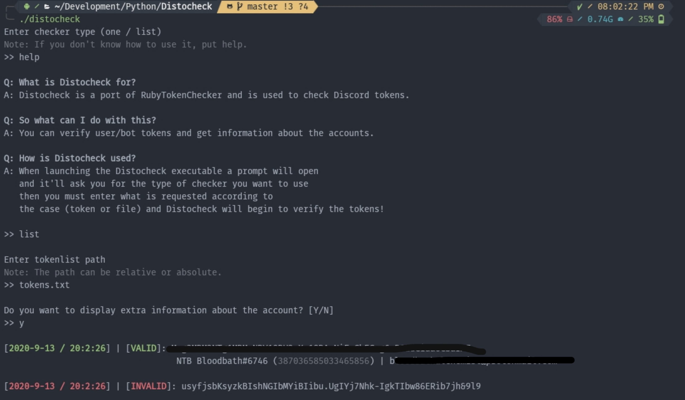

# Distocheck - Discord Token Checker
Distocheck is a port to Python of [RubyTokenChecker](https://github.com/3CDevelopment/RubyTokenChecker).



---

## Disclaimer
**This project is made for educational purposes,**
**therefore we do not take responsibility for the**
**actions of those who may use this project for malicious purposes.**

---

# Usage
```sh
python3 -m pip install -r requirements.txt

./distocheck
```

Then select the checker type (one / list).

If you have selected list, you can save the
tokens in any file **but we recommend a text file**.

> Note: if you are going to check a bot's token, you must place Bot before the token.

---

# Contributing
See how to contribute by reading [Contributing](./CONTRIBUTING.md).

# Code of Conduct
See our [Code of Conduct](./CODE_OF_CONDUCT.md).

# License
This project is under [MIT License](./LICENSE).
